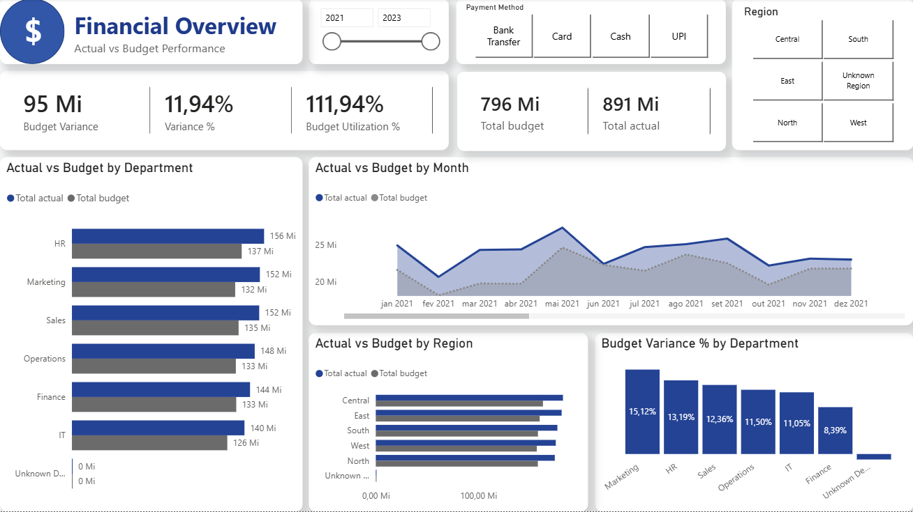

# Financial Dashboard — Power BI

Interactive Financial dashboard developed in Microsoft Power BI to analyze budget performance, actual spending, financial variance, departments, regions, payment methods, and monthly financial trends.

## Project Overview

This project was developed as part of my data analytics portfolio using a financial dataset containing budget and actual transaction information.

The main objective was to transform raw financial data into an interactive dashboard that provides a clear overview of the organization's financial performance and helps identify important budget trends and deviations.

The dashboard brings together different financial indicators into a single analytical view, making it easier to monitor budget performance, actual spending, variance, departmental results, regional performance, and monthly trends.

## Tools & Technologies

* Microsoft Power BI
* DAX
* Power Query
* Data Cleaning & Transformation
* Data Analysis
* Data Visualization
* Interactive Dashboard
* KPI Development

## Dataset

The project uses the Budget vs Actual dataset, containing financial transaction information such as:

* Transaction ID
* Date
* Department
* Category
* Region
* Budget Amount
* Actual Amount
* Payment Method

The dataset contains 10,000 financial transactions used to analyze budget performance and actual spending.

## Dashboard



### Key Metrics & Analysis

The dashboard provides insights into several financial indicators, including:

* Total Budget
* Total Actual
* Budget Variance
* Budget Variance %
* Budget Utilization %
* Actual vs Budget by Department
* Actual vs Budget by Month
* Actual vs Budget by Region
* Budget Variance % by Department
* Payment Method Analysis
* Monthly Financial Performance
* Department Analysis
* Regional Analysis

## Key Questions

The dashboard was designed to help answer questions such as:

* What is the total budget compared to actual spending?
* Is actual spending above or below the planned budget?
* Which departments have the highest budget variance?
* Which departments are performing above or below their allocated budget?
* How does actual spending compare to budget throughout the year?
* Which months have the highest actual spending?
* Which regions have the highest budget and actual values?
* Which departments have the highest variance percentage?
* How does financial performance change across different payment methods?
* Which areas require greater attention due to significant budget deviations?

## Business Objective

The purpose of this dashboard is to transform financial data into actionable information that can support data-driven decision-making.

By consolidating budget, actual spending, variance, departmental, regional, and monthly indicators, the dashboard allows decision-makers to monitor financial performance and identify areas where actual results differ from planned values.

## Project Structure

```text
financial-dashboard-powerbi/
│
├── README.md
│
├── dashboard/
│   └── Dashboard - Financeiro.pbix
│
├── data/
│   └── Budget_vs_Actual_Data.xlsx
│
└── images/
    └── dashboard-preview.png
```

## How to Use

1. Download the Power BI file from the `dashboard` folder.
2. Open the file using Microsoft Power BI Desktop.
3. If necessary, update the data source connection to the Excel file located in the `data` folder.
4. Use the available filters and interactive elements to explore the dashboard.
5. Navigate through the different financial indicators and visualizations.

## Skills Demonstrated

This project demonstrates practical skills in:

* Data cleaning
* Data transformation
* Data analysis
* Financial Analytics
* KPI development
* DAX
* Power Query
* Data visualization
* Interactive dashboards
* Business Intelligence
* Data storytelling
* Microsoft Power BI

## Key Takeaways

This project demonstrates how raw financial data can be transformed into an interactive analytical tool capable of providing a broader understanding of budget performance and financial trends.

The dashboard emphasizes the importance of comparing planned and actual results to identify deviations, monitor performance, and support data-driven financial decision-making.

## Author

Dalto Duarte

This project was developed as part of my data analytics portfolio, with a focus on developing practical skills in data analysis, business intelligence, financial analytics, and dashboard development.
